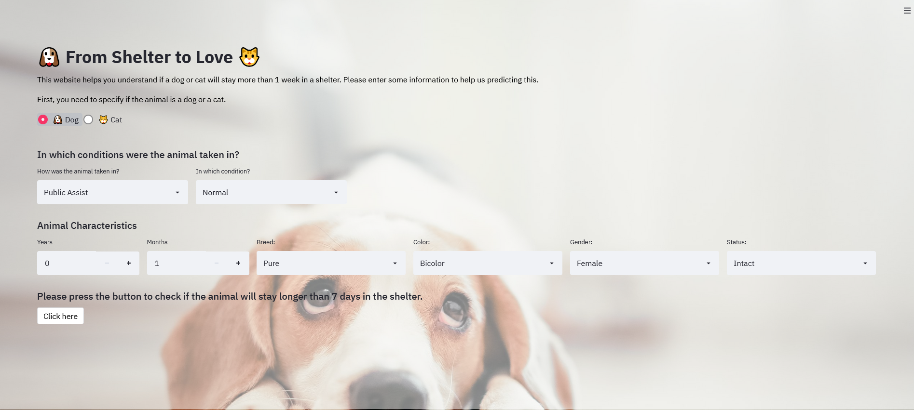

# From Shelter to Love
How long do stray animals spend in a shelter until they find a “forever home”?

With `from_shelter_to_love` lets help the staff to understand if a dog or cat will stay more than 1 week in their shelter.

[](https://from-shelter-to-love.herokuapp.com/)


# Startup the project

The initial setup.

Create virtualenv and install the project:
```bash
sudo apt-get install virtualenv python-pip python-dev
deactivate; virtualenv ~/venv ; source ~/venv/bin/activate ;\
    pip install pip -U; pip install -r requirements.txt
```

Unittest test:
```bash
make clean install test
```

Check for From_Shelter_to_Love in gitlab.com/{group}.
If your project is not set please add it:

- Create a new project on `gitlab.com/{group}/From_Shelter_to_Love`
- Then populate it:

```bash
##   e.g. if group is "{group}" and project_name is "From_Shelter_to_Love"
git remote add origin git@github.com:{group}/From_Shelter_to_Love.git
git push -u origin master
git push -u origin --tags
```

Functionnal test with a script:

```bash
cd
mkdir tmp
cd tmp
From_Shelter_to_Love-run
```

# Install

Go to `https://github.com/{group}/From_Shelter_to_Love` to see the project, manage issues,
setup you ssh public key, ...

Create a python3 virtualenv and activate it:

```bash
sudo apt-get install virtualenv python-pip python-dev
deactivate; virtualenv -ppython3 ~/venv ; source ~/venv/bin/activate
```

Clone the project and install it:

```bash
git clone git@github.com:{group}/From_Shelter_to_Love.git
cd From_Shelter_to_Love
pip install -r requirements.txt
make clean install test                # install and test
```
Functionnal test with a script:

```bash
cd
mkdir tmp
cd tmp
From_Shelter_to_Love-run
```
